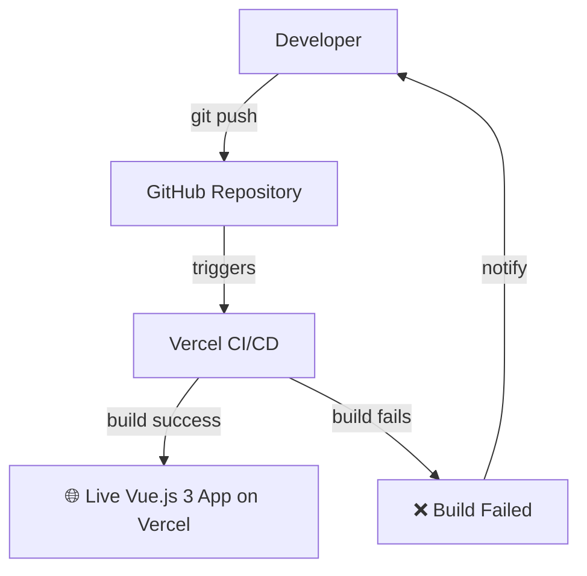
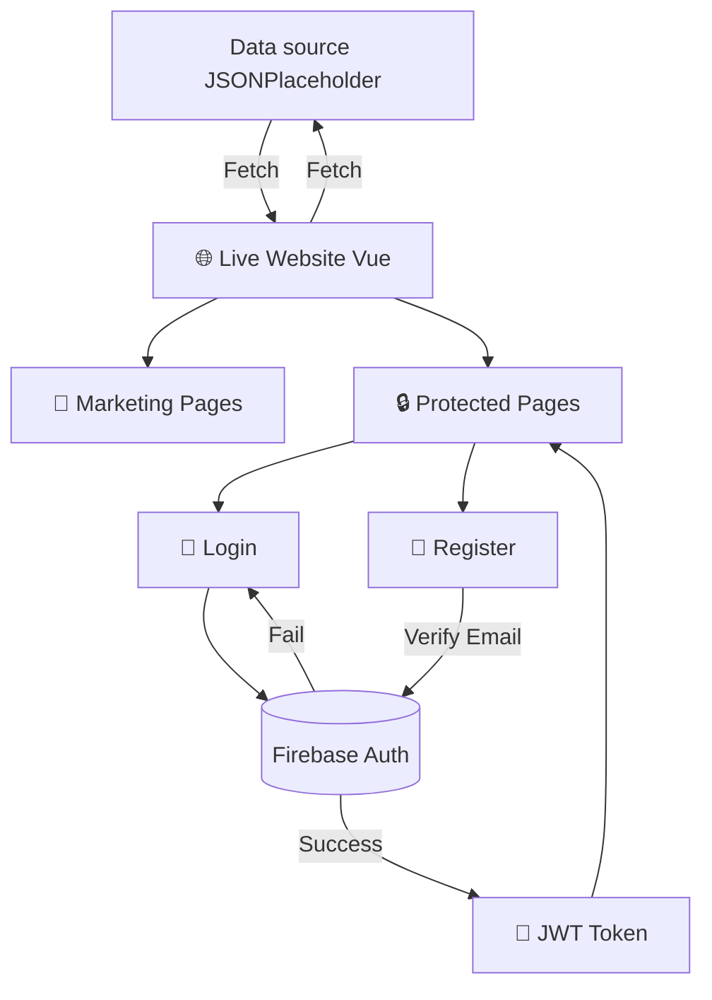

# vuevibe

https://vuevibe.vercel.app/

## Project Setup

```sh
pnpm install
```

### Compile and Hot-Reload for Development

```sh
pnpm dev
```

### Type-Check, Compile and Minify for Production

```sh
pnpm build
```

### Lint with [ESLint](https://eslint.org/)

```sh
pnpm lint
```

### Tech Stack & Tooling

Framework: Vue 3 (Composition API)

Build Tool: Vite

Store: Pinia

Router: Vue Router

Linting: ESLint + Prettier

Type Checking: vue-tsc

### Deployment & CI/CD

Vercel Integration
The project is optimized for Vercel with a fully automated CI/CD pipeline:

Production Triggers: Merges to the main branch trigger a production build and deployment.



### Firebase Authentication

This project uses Firebase Auth for secure user management.

Session Persistence: Configured to maintain user state across browser refreshes using onAuthStateChanged.


