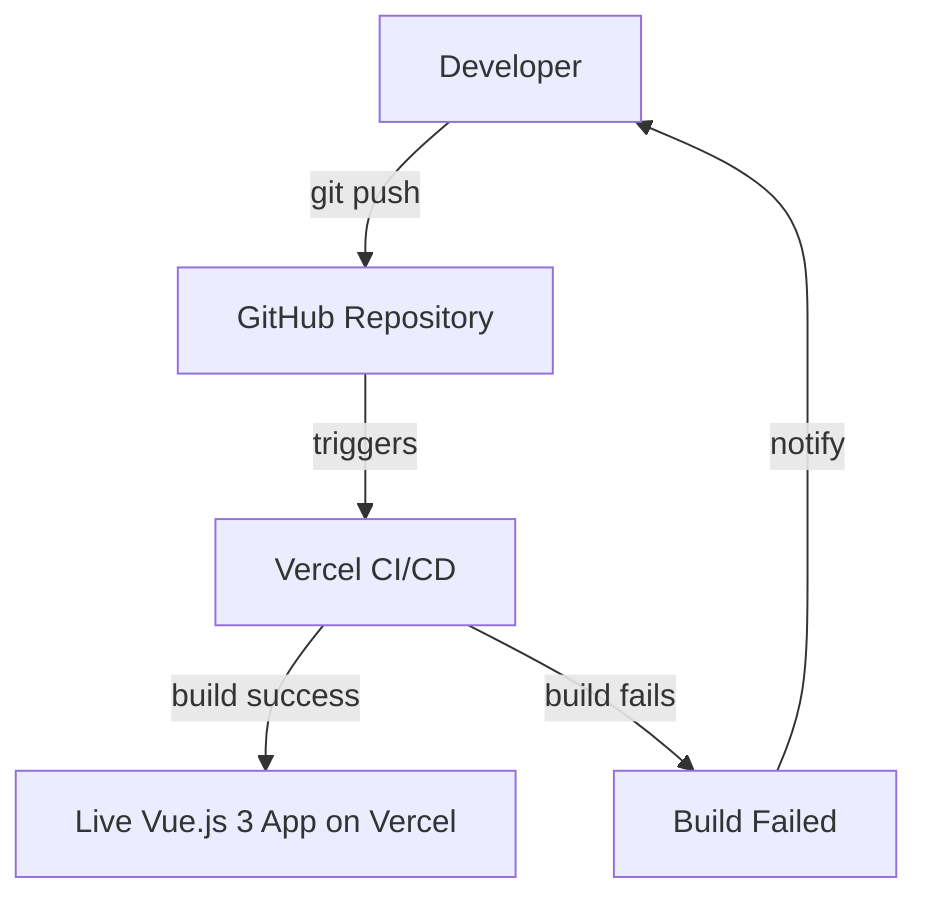
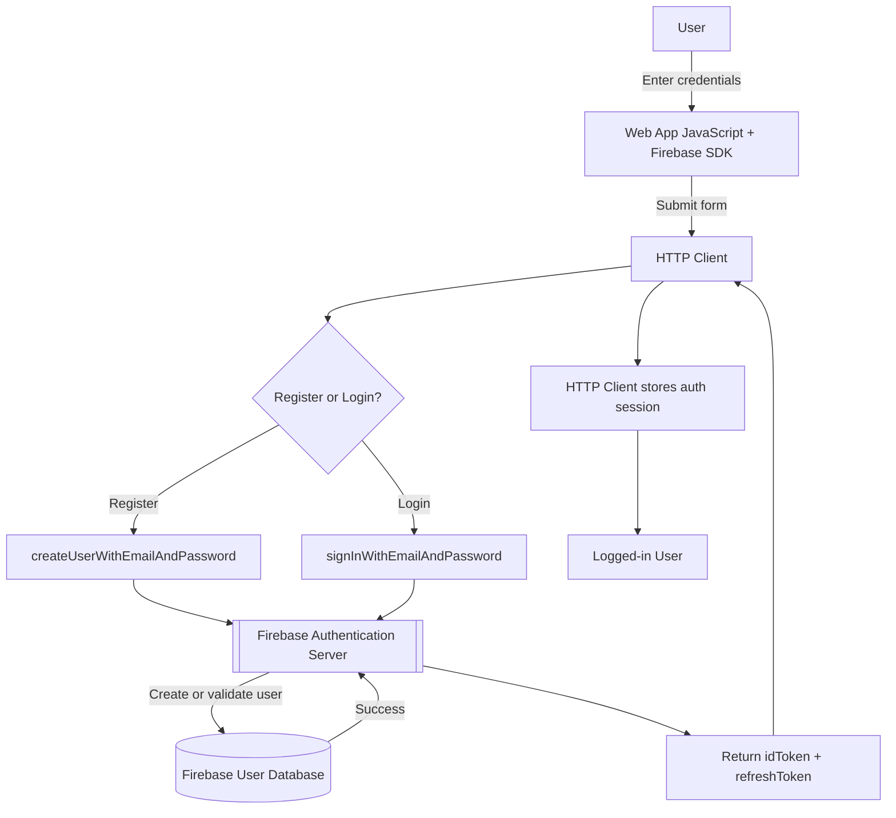

# VueVibe


> A modern Vue.js 3 application with Firebase Authentication and automated CI/CD via Vercel.

🔗 [Live Demo](https://vuevibe.vercel.app/)

---

## Table of Contents

- [Project Setup](#project-setup)
- [Tech Stack & Tooling](#tech-stack--tooling)
- [Environment Variables](#environment-variables)
- [Deployment & CI/CD](#deployment--cicd)
- [Firebase Authentication](#firebase-authentication)
- [Roadmap](#roadmap)
- [License](#license)

---

## Project Setup

```sh
pnpm install
```

### Compile and Hot-Reload for Development

```sh
pnpm dev
```

### Type-Check, Compile and Minify for Production

```sh
pnpm build
```

### Lint with [ESLint](https://eslint.org/)

```sh
pnpm lint
```

---

## Tech Stack & Tooling

| Category      | Tool                    |
| ------------- | ----------------------- |
| Framework     | Vue 3 (Composition API) |
| Build Tool    | Vite                    |
| Store         | Pinia                   |
| Router        | Vue Router              |
| Auth          | Firebase                |
| Linting       | ESLint + Prettier       |
| Type Checking | vue-tsc                 |
| Deployment    | Vercel                  |

---

## Environment Variables

Create a `.env` file in the root of the project:

```sh
VITE_API_BASE_URL=

VITE_FIREBASE_API_KEY=
VITE_FIREBASE_AUTH_DOMAIN=
VITE_FIREBASE_PROJECT_ID=
VITE_FIREBASE_STORAGE_BUCKET=
VITE_FIREBASE_MESSAGING_SENDER_ID=
VITE_FIREBASE_APP_ID=
VITE_FIREBASE_MEASUREMENT_ID=
```

---

## Deployment & CI/CD

The project is optimized for Vercel with a fully automated CI/CD pipeline. Merges to the `main` branch trigger a production build and deployment.



---

## Firebase Authentication

This project uses Firebase Auth for secure user management. Session state is persisted across browser refreshes using `onAuthStateChanged`.



## Roadmap

- [x] Firebase Authentication
- [x] CI/CD with Vercel
- [x] JSONPlaceholder API integration
- [ ] Replace JSONPlaceholder with real backend (Strapi)
- [ ] Dark mode
- [ ] User profile page
- [ ] User avatar upload
- [ ] Pagination
- [ ] Search & filter
- [ ] Favorite / bookmark posts
- [ ] Comments section
- [ ] Unit tests
- [ ] E2E tests with Playwright
- [ ] PWA support

---

## License

MIT
